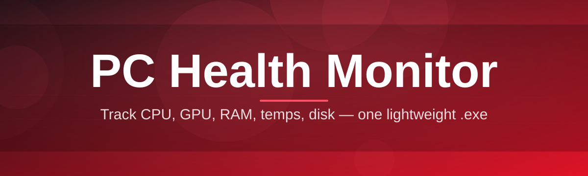
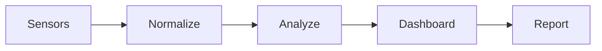

# pc-health-optimizer 🩺⚙️

  

*Your PC's vital signs, translated into plain English — one glance, zero guesswork.*

  

## 🔭 Overview

Most people find out their PC is struggling only after it stalls mid-task, fans scream during a video call, or a drive silently fills up until Windows starts complaining. **pc-health-optimizer** exists to close that gap — it's a lightweight PC Health Monitor that reads the signals your hardware is already broadcasting (temperatures, disk wear, memory pressure, startup bloat) and turns them into something a human can actually act on, instead of a wall of raw sensor numbers.

This project was built for the people in between two extremes: not the enterprise IT admin with a full monitoring suite, and not the person who wants to blindly click "optimize" and hope. It's for the tinkerer who wants transparency, the gamer who wants to know *why* their frame times got worse, the small-business owner running a fleet of aging desktops, and the student trying to squeeze another year out of a laptop before a replacement is in the budget. Every metric shown has a "why it matters" behind it — thermal headroom, SMART health, startup impact — because a health monitor that hides its reasoning isn't much different from a black box.

We also care a lot about *how* this tool feels to use. PC health tooling has a reputation for being either scary (walls of red warnings) or dishonest (fake "1,204 errors found!" popups designed to sell an upgrade). pc-health-optimizer takes neither approach — it's an honest, open-source, community-audited diagnostic companion. No telemetry phoning home, no upsells, no dark patterns. Just your system, explained clearly, with an active community shaping what gets measured next.

## 🌟 Overview → Get Started

  

> [!TIP]
> New here? Star the repo first so you don't lose track of it — releases ship frequently and the changelog at the bottom moves fast.

---

## 🧩 What It Actually Does

- **Live thermal storytelling** — tracks CPU, GPU, and (where available) motherboard sensor temps over time, and instead of just a number, it tells you whether that number is "cruising," "warming up," or "time to check your fans."

- **Startup weight audit** — every app claiming a slice of your boot sequence gets scored by actual measured delay, not vague "high/medium/low" labels, so you can see exactly which app is stealing your first 40 seconds.

- **Drive fatigue tracking** — reads SMART attributes and reframes them as a simple wear narrative for HDDs and SSDs alike, flagging early signs of decline well before Windows itself would notice.

- **Memory pressure timeline** — a rolling view of RAM and page-file usage that helps you tell the difference between "one heavy app" and "a slow accumulating leak."

- **Background process spotlight** — surfaces processes quietly consuming CPU or disk I/O in the background, the kind that never show up unless you go looking for them.

- **One-click health snapshot export** — generates a shareable report of your system's current state, handy for forum troubleshooting or before/after comparisons after a cleanup.

- **Smart alert thresholds** — configurable warning levels so a laptop that idles warm doesn't spam you with false alarms tuned for a desktop tower.

- **Offline-first design** — every check runs locally; nothing about your hardware profile ever leaves your machine.

> [!NOTE]
> "Optimizer" in the name refers to *insight-driven* tuning suggestions (startup trimming, background task flagging) — not registry gimmicks or one-click miracle fixes. We're allergic to snake oil.

---

## 🚀 How to Get Started

1. Visit the landing page via the download button above.

2. Grab the latest standalone build — no installer wizard, no bundled extras.

3. Run the executable directly; Windows may show a SmartScreen prompt for new signed builds — click "More info → Run anyway" the first time.

4. Let the initial scan finish (usually under 30 seconds) and explore your dashboard.

> [!IMPORTANT]
> Run your first scan on AC power if you're on a laptop — battery-saver mode throttles sensors and can produce misleadingly calm readings.

---

## 💻 System Requirements

| Requirement | Details |
|---|---|
| OS | Windows 10 (64-bit) or Windows 11 |
| Dependencies | None — fully standalone, no runtime installs required |
| Disk space | Under 100 MB |
| RAM | 4 GB minimum, 8 GB+ recommended for smooth live graphs |
| Permissions | Standard user works; Administrator unlocks deeper sensor access |

  

---

## 🛠️ How It Works

The architecture is intentionally simple — three layers, no daemon, nothing that outlives the app when you close it.

1. **Sensor layer** — polls hardware sensors (thermal, disk, memory, process table) at a configurable interval.

2. **Normalization layer** — converts raw values into consistent units and compares them against known-safe baselines.

3. **Insight engine** — turns the normalized data into human-readable status and suggestions.

4. **Dashboard renderer** — paints the live view, alerts, and exportable snapshot.

> [!TIP]
> You can lower the polling interval in Settings if you're monitoring during a stress test — the default cadence is tuned for everyday background use, not benchmarking.

---

## 🩹 Troubleshooting

<strong>Temperatures show as 0 or "N/A"</strong>

Some motherboards restrict sensor access to Administrator-level processes. Try relaunching with elevated permissions.

<strong>The app flags high disk usage but Task Manager disagrees</strong>

pc-health-optimizer measures sustained I/O over a rolling window rather than an instantaneous snapshot, so brief spikes read differently between the two tools — this is expected and usually more accurate for spotting real bottlenecks.

<strong>SmartScreen warning on first launch</strong>

This is standard for newer independently signed builds without long reputation history yet. Choose "More info → Run anyway." The binary is built directly from this public repository.

<strong>Startup audit list looks empty</strong>

Some entries live in scheduled tasks rather than the classic startup folder — enable "Deep scan" in Settings to include those.

<strong>SMART health shows "Unknown" for an external drive</strong>

Many USB enclosures don't pass SMART data through the bridge chipset. This is a hardware limitation, not a bug in the tool.

> [!WARNING]
> If temperatures spike suddenly and stay high even at idle, stop stress-testing immediately and check physical airflow/dust buildup before anything else — software can't fix a blocked heatsink.

---

## 🎨 UI / UX Details

- **Themes** — Light, Dark, and an OLED-friendly true-black mode.

- **Keyboard shortcuts**:

  | Shortcut | Action |
  |---|---|
  | `Ctrl + R` | Refresh all sensors |
  | `Ctrl + E` | Export health snapshot |
  | `Ctrl + ,` | Open Settings |
  | `Ctrl + 1/2/3` | Switch dashboard tabs |

- **Settings** — polling interval, alert thresholds per component, unit preference (°C/°F), and a "quiet mode" that suppresses non-critical notifications.

> [!NOTE]
> Layout and shortcut preferences are saved locally in a small config file next to the executable — nothing is written to the registry.

---

## 🤝 Contributing & Community

This project grows because people like you file issues, suggest metrics, and send pull requests. Whether you're fixing a typo or building a new sensor module, you're welcome here.

- Check the **Issues** tab for items tagged `good first issue` — they're scoped intentionally small for newcomers.

- Have an idea for a new metric or dashboard view? Open a **Discussion** before a PR so we can align on approach.

- Roadmap items currently being explored: multi-monitor dashboard docking, historical trend graphs beyond 24h, and community-submitted alert threshold presets for common hardware profiles.

- Translations, documentation improvements, and UI polish are just as valued as core engine contributions.

> [!TIP]
> Look for the `help wanted` label if you want something a bit meatier than a first issue — those usually touch the sensor or insight-engine layers.

---

## 📜 License

Released under the [MIT License](LICENSE), 2026.

## ⚠️ Disclaimer

pc-health-optimizer reports on system health based on available hardware sensor data; sensor accuracy varies by manufacturer and motherboard. This tool does not modify system files, drivers, or registry settings, and is provided "as is" without warranty. Always use good judgment — and proper physical maintenance — alongside any software diagnostics.

---

## 📝 Changelog

### v2026.3 — "Quiet Hours"
- Added quiet mode for suppressing non-critical alerts
- Fixed SMART reads failing silently on some NVMe controllers
- Improved startup audit accuracy for scheduled-task entries

### v2026.2 — "Clearer Skies"
- Introduced true-black OLED theme
- Reworked memory pressure timeline for smoother rendering
- Community-requested: per-component alert thresholds

### v2026.1 — "First Light"
- Initial public release of the standalone dashboard
- Core sensor layer for CPU/GPU temps, disk health, and memory
- One-click health snapshot export

  

